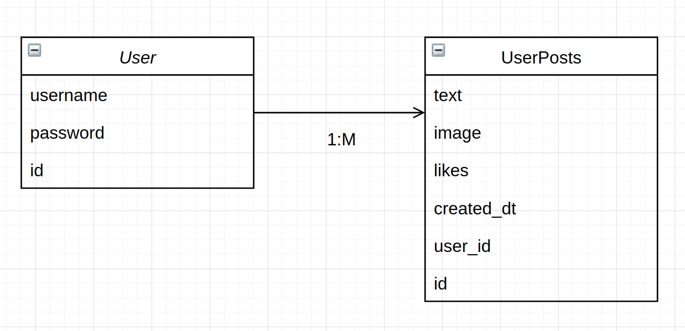

# MightyBlockTest

## Testing

To run unit tests a local python virtual environment should be configured. So, first create the virtual environment with the venv module and install the dependencies:

```
(from project home)
python3 -m venv venv
source venv/bin/activate
pip install --upgrade pip
pip install -r requirements.txt
```

To run the unit tests:

```
export PYTHONPATH=$PWD/src
pytest -x -v src/test
```

## Running locally with Docker

A docker-compose file is included that will run postgres database and Flask API on the local machine.

### Requirements

- docker
- docker-compose
- Python 3.8+

Ports 5000 must be available. The API will be hosted on port 5000.

### Build and run

Build can be done with:

```
docker-compose build
```

To run the containers, use the command:

```
docker-compose up
```

When the docker is running, you can access to the API documentation using the URL in output:

```
web-api_1   |    WARNING: This is a development server. Do not use it in a production deployment.
web-api_1   |  * Running on http://172.19.0.5:5000/ (Press CTRL+C to quit)
```

## Running API locally without Docker

You can run the next command to access to the API locally. This will allow to check API documentation without Docker.

```
python bin/run.py
```

## Database

Postgresql was chosen because is highly scalable. All the apps needs to be prepared to support a bigger usage/traffic. Also, we can do several data analysis queries over the DB.
Another important thing, is that the DB allows binary types. This can be used for images for example. Anyway, to deal with media files, is better to use a mechanism with AWS S3, GoAnyWhere, or similar technologies.

